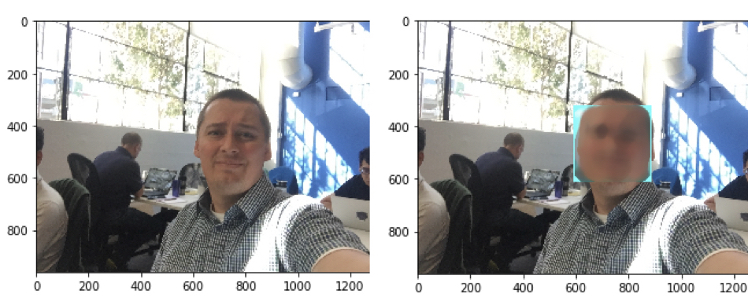
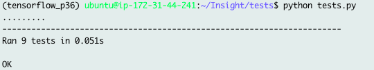
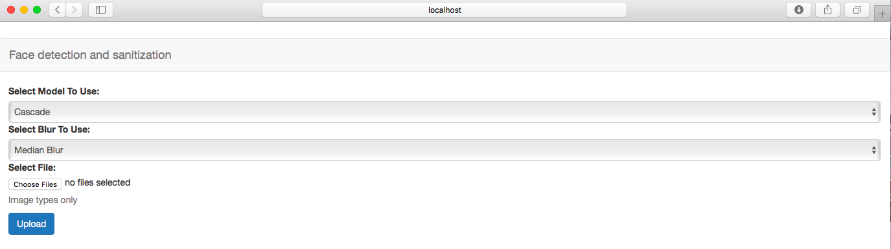

# [HideFaces.AI](http://bit.ly/HideFaces)
Author: Tomasz Palczewski

## Main Goal

- The main goal was to build a pipeline that tests different object detection algorithms that might be used for an automatic anonimization of faces in still pictures

- I decided to implement and test two algorithms: 

  - Simple Machine Learning algorithm, Haar Cascade Classifier, that is commonly used in business aplications. This choice was motivated by the simplicity of approach and time constraints. I wanted to obtain a minimum viable product quickly and from this point move on to more sophisticated and challenging approaches. I decide to use previously trained Haar Classifier (trained on frontal face images). 
 
  - Deep Learning algorithm, from single stage detectors family, You Only Look Once (YOLO). 


If you would like to train Haar from scratch this post presents in detail all necessary steps: 

[https://memememememememe.me/post/training-haar-cascades](https://memememememememe.me/post/training-haar-cascades/)
 

The YOLO implementation is based on Keras (high-level neural networks API). I decided to perform transfer learning for YOLO model that was previously trained on [COCO Dataset](http://cocodataset.org). This project borrows a lot of code from this git-hub repository: 

[https://github.com/experiencor/keras-yolo2](https://github.com/experiencor/keras-yolo2)


<p align="center">
  
</p>


## Setup, requisites, environment settings, and tests
- To clone repo, set environment variables and install needed libraries
```
git clone https://github.com/tpalczew/HideFaces.git
cd HideFaces
source ./build/environment.sh
pip install -r build/requirements.txt
```

This project was developed and tested on AWS E2 instance using Deep Learning AMI (Ubuntu) Version 15.0 (ami-0b43cec40e1390f34)
using python3. The pip freez for this specific setting is shown [here](https://github.com/tpalczew/HideFaces/blob/master/static/aws-e2-requirements.txt)

- All tests are placed in the HideFaces/tests/ directory. To run tests:
```
cd tests
python tests.py
```
as an output one should see a similar output:
<p align="center">
  
</p>
This scrip will perform nine different simple tests of different parts of the code such as tests of
- function to calculate an intersection over union value for two bounding boxes

- interval overlap function that is used during the calculation of an intersection over union value

- sigmoid and softmax functions

- correctnes of the data shapes after preprocessing process


## Run Inference
Face detection and blurring on a single image may be performed using command line script
```
python app.py --infile /dir/subdir/file.jpg --outfile /dir/subdir/file_blur.jpg --blur blur_type --model model_type
```
Available blur types are as follows: Median Blur (use medianBlur), Gaussian Blur (use GaussianBlur), Bilateral Filter (use bilateralFilter), Averaging (use blur). The default blur is a Median Blur. 

There are two models that can be used to detect faces: Haar Cascade Classifier (use haar) or YOLO (use yolov2).
The default model is a Haar Cascade Classifier


## Serve Model

I prepared a Flask webapp that you can activate using app_flask.py script

```
python app_flask.py
```

and than browse to http://localhost:5000 and as an otcome you should see options to a select model, blur type, and upload your picture. 

<p align="center">
  
</p>


## Datasets & Data Augmentation

At the end, I decided to only focus on examples from two public datasets, WIDER face ([link](http://mmlab.ie.cuhk.edu.hk/projects/WIDERFace/)), Kaggle face dataset ([link](https://www.kaggle.com/c/face-recognition/data)), and my pictures. To colect own pictures, I used google_images_download.py script from [https://github.com/hardikvasa/google-images-download](https://github.com/hardikvasa/google-images-download) 
and drew bounding boxes using RectLabel software. As the number of examples was sufficient for my task, I haven't perfrmed data augmentation. Hovever, if you need to augment your dataset for object detection, one of many possible options is to use this git-hub repo [link](https://github.com/Paperspace/DataAugmentationForObjectDetection)


## Transfer learning for YOLO

The script (retrain_yolo_v2.py) to retrain yolo algorithm is located in 

src/preprocess/

it needs yolo coco weights (yolo.weights) that should be located in data/preprocessed/model_weights/ directory.
In addition, images and annotations for re-training should be located in the follows locations:

 - train image folder = /data/raw/face/large/train/

 - train annotation folder = /data/raw/face/large/train_ann/

 - valid image folder = /data/raw/face/large/val/

 - valid annotation folder = /data/raw/face/large/val_ann/

To run retraining script:
```
python retrain_yolo_v2.py --out_model serialized_model_to_json --out_weights serialized_weights --out_full serialized_full_model
```

it will store all the configuration information to /data/preprocessed/config_yolo.json


## Project presentation

One can find a few slides detailing project pipeline online here: [http://bit.ly/HideFaces](http://bit.ly/HideFaces)
